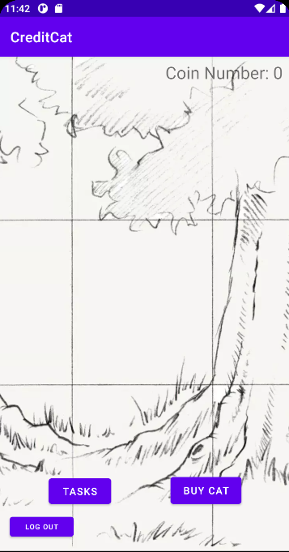

# CreditCat 🐱
CreditCat is an Android App that encourages more people to adopt better spending habits through the power of cats! Let cats help your credit!

## Description ✏️

CreditCat is an Android App that helps people from around the world to become better at budgeting and financing. User can earn coins through daily finance quizzes, setting up a budget plan, and learning about new finance knowledge. In the future users will be able to link their credit cards for automatic updates on when they pay back their credit cards on time. CreditCat is here to make people more fiancially responsible.

## Technologies ⚙️

- [Java](https://www.java.com/en/)
- [Android Studio](https://developer.android.com/studio)
- [Glide](https://github.com/bumptech/glide)
- [Parse](https://parseplatform.org/) / [Back4App](https://dashboard.back4app.com/)

## Site 🖥️

### Login Page

### Landing Page

